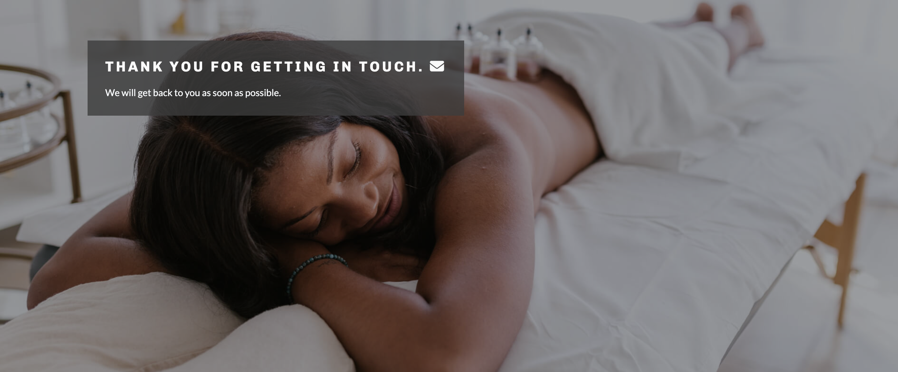

# Max Rehab Physiotherapy

[View the live project here](https://roc-11.github.io/max-rehab/index.html)

## Table of Contents

***

## Introduction

This comprehensive website was made for the fictional company Max Rehab Physiotherapy in Cork, Ireland. The site will be targeted toward customers who require physiotherapy treatment as a reult of an injury or operation, and returning customers who wish to book maintenance physiotherapy sessions. It is responsive across a range of devices and it is easy for site users to navigate.

## UX

### Ideal User Demographic

The ideal user for this website is:

* Current user
* New user
  
### User-Stories
#### Current User Goals
1. As a current user, I want to be able to book/contact a physiotherapy session easily.
2. As a current user, I want to easily navigate through the site and access the information I require.
3. As a current user, I want to easily navigate to content I have previously viewed within a small number of steps.

#### New User Goals
1. As a new user, I want to easily navigate the entire site intuitively. 
2. As a new user, I want the information I seek to be easily accessible and relevant.
3. As a new user, I want attractive and relevant visuals and colour schemes that work with the content.
4. As a new user, I want to be able to book/contact a physio session easily.

## Features

### Navigation

* Featured at the top of the page, the navigation shows the Max Rehab logo in the left corner. For smaller devices, the logo centred at the top of the page. This logo links to the home page. 
* The other navigation links are to the right: Home, About Us, Our Services and Contact Us which link to different pages of the site. 
* The navigation is in an uppercase, dark font which contrasts with the background.
* The active page which the user is currently on is underlined. 
* When the user hovers over a link, the link is clearly underlined.
* The navigation makes clear the name of the company and website.
* The navigation makes the different sections of information easy to find.
  

### The Header

* The header displays an eye-catching background image of a physiotherapist working with a patient. 
* The header catches the users attention with a slogan "Maximise your healing" and a subheader "Start your recovery today". The headers are an off-white colour to contrast with the background image and a clearly visible. 
* The header includes a green button "BOOK NOW" which takes the user to the contact us page.
* The header provides the user with clear information about what the site is.
  

### About

* This section is a descriptive part of the wesbite which provides users with information as to how Max Rehab can help them. 
* It is clearly divided into a row of 4 information boxes, showing the main services Max Rehab provides to clients - 'Online Physio', 'Post-op Rehab', 'Physiotherapy' and 'Pain Management'.
* There is a short text desription of the 4 main services.
* The information boxes are a dark green in keeping with the theme of the website, and text is a contrasting white colour. 
* On smaller devices, the row of boxes becomes stacked to maximise available screenspace.
* The about section includes a green button "VIEW ALL SERVICES" which takes the user to the services page, which more indepth information on the services provided. 
   

### Insurance

* The insurance section shows the user which medical insurance companies are covered at Max Rehab.
* Clients are covered by all major medical health insurers, and there is a note explaining this is not an exhaustive list.
* The company logo of the main Irish health insurers are displayed beneath the heading and note in a row.
 

### Reviews

* The reviews section displays what previous clients thought of the Max Rehab services.
* This section presents a row of 3 visually appealing reviews, with styled quotation marks. The reviewer's name is displayed below the quote in italics beside a photo avatar of the client.
* The reviews and customer images help establish credibility and trust with potential clients.  
   

### Footer

* The classic footer is preceded by a Google Map section showing the precise location of the Max Rehab clinic. 
* The footer text presents as white on a background of dark green in keeping with the theme of the website. 
* The footer contains three columns of essential information a user would need about the company: socials, opening hours and contact information.
* The socials column provides clickable icons linking to Max Rehab Instagram, Twitter and Facebook social media pages. These encourage the user to follow the company on various social media platforms.
* The opening hours column clearly displays the times of business operation in larger bold text.
* The contact us column provides the company phone, email and address. 
   

### About Us Page

* The about us page provides the user with more detail about Max Rehab, the company goals and the staff memebers. 
* The page will look familar to the user, continuing the navigation menu, header and footer from the homepage. 
* The user is presented with a short information paragraph, followed by the 'Meet Our Team' section.
* The 'Meet Our Team' highlights the physiotherapists working at Max Rehab, arranged in a 2 column grid. Each physio's name, title and qualifications are provided as a heading, followed by a short blurb about the therapist. Beisde the text is an image of the physio with an icon which will take the user to the physio's LinkedIn account. 
* On smaller devices column grids are stack on smaller devices so that each physio's description is displayed first with their picture below.
   

### Our Services Page

* The 'our services' page provides the user with more detailed information about Max Rehab's services. 
* The main physiotherapy services/techniques are displayed in graphic form, wih 6 icons.
* The 'your visit' section is mainly for first time site users. These users are provided with a description of how the physiotherapy services works, from initial visit, to planning treatment, to follow-up appointments. 
* The section includes an embedded YouTube video with relevant content. The video explains to first time users what to expect from their first sessions. It encourages the user to interact longer with the content and, as a result, become a new customer.
   

### Contact Us Page

* The contact us page is a key element of the webiste as it allows users to make interaction with the business, make an enquiry and book an appointment to become a client. 
* The page shows a form in front of a banner image. All form fields are required and validated. The active form input is highlighted with a change of border colour. The form provides users with feedback in case the input is incorrect. 
* Upon successful completion of the form, the user can click the submit button. The website then provides user feedback by transferring them to the thankyou.html page.
* The 'thank you' page shows a simple message 'thank you for getting in touch' so that the user knows the form has been successfully submitted. 
   
  