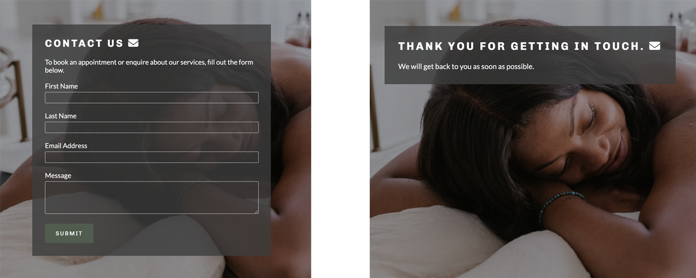

# Max Rehab Physiotherapy

## Developer: Róisín O'Connell 

[View the live project here](https://roc-11.github.io/max-rehab/index.html)

## Table of Contents
- [Max Rehab Physiotherapy](#max-rehab-physiotherapy)
  - [Developer: Róisín O'Connell](#developer-róisín-oconnell)
  - [Table of Contents](#table-of-contents)
  - [Introduction](#introduction)
  - [Aim](#aim)
    - [Business Goals](#business-goals)
    - [User Goals](#user-goals)
  - [UX](#ux)
    - [Ideal User Demographic](#ideal-user-demographic)
    - [User-Stories](#user-stories)
      - [Current User Goals](#current-user-goals)
      - [New User Goals](#new-user-goals)
    - [Development-Planes](#development-planes)
      - [Strategy](#strategy)
      - [Scope](#scope)
      - [Structure](#structure)
      - [Skeleton](#skeleton)
    - [Design](#design)
      - [Colour Scheme](#colour-scheme)
      - [Typography](#typography)
      - [Imagery](#imagery)
  - [Features](#features)
    - [Navigation](#navigation)
    - [The Header](#the-header)
    - [About](#about)
    - [Insurance](#insurance)
    - [Reviews](#reviews)
    - [Footer](#footer)
    - [About Us Page](#about-us-page)
    - [Our Services Page](#our-services-page)
    - [Contact Us Page](#contact-us-page)
    - [404 - Page Not Found](#404---page-not-found)
    - [500 Page](#500-page)
    - [Features to Implement in the future](#features-to-implement-in-the-future)
  - [Technologies Used](#technologies-used)
    - [Main Languages Used](#main-languages-used)
    - [Frameworks, Libraries \& Programs Used](#frameworks-libraries--programs-used)
  - [Testing](#testing)
  - [Responsiveness](#responsiveness)
  - [Bugs/Known Issues](#bugsknown-issues)
  - [Deployment](#deployment)
    - [Deploying on GitHub Pages](#deploying-on-github-pages)
  - [Credits](#credits)
    - [Content](#content)
    - [Media](#media)
    - [Code](#code)
  - [Acknowledgements](#acknowledgements)
***

## Introduction

This comprehensive website was made for the fictional company Max Rehab Physiotherapy in Cork, Ireland. The site will be targeted toward customers who require physiotherapy treatment as a reult of an injury or surgery, and returning customers who wish to book maintenance physiotherapy sessions. It is responsive across a range of devices and it is easy for site users to navigate.

This website was made for the first of five Milestone projects required to complete the Diploma in Full Stack Software Development (e-Commerce Applications) program at [Code Institute](https://codeinstitute.net/ie/ "Link to Code Institute homepage").

The main requirements of this project are to build a responsive and static front-end site to present useful information to users using all the technologies learned so far (HTML5 and CSS3).

## Aim

The aim of this website to provide users with information about Max Rehab Physiotherapy with the view of the user eventually making a physio booking and becoming a user of the services.

### Business Goals

* To provide users with infomation about Max Rehab Physiotherapy, the services the busniess offers, and meet the business team.
* To provide users with essential contact information, in order to attract enquires and bookings from new and existing customers.
* To increase Max Rehab engagement with customers - linking clients to the business' various social media platforms.

### User Goals
* Navigate easily through the website
* Learn more about Max Rehab Physiotherapy
* Check business location and opening hours
* Contact Max Rehab and learn how to book an appointment
* Find out information about the staff of Max Rehab
* Learn about the services Max Rehab offers
* Find out what to expect from a first visit to Max Rehab

## UX

### Ideal User Demographic

The ideal user for this website is:

* Current user
* New user
  
### User-Stories
#### Current User Goals
1. As a current user, I want to be able to contact/book a physiotherapy session easily.
2. As a current user, I want to easily navigate through the site and access the information I require.
3. As a current user, I want to easily navigate to content I have previously viewed within a small number of steps.

#### New User Goals
1. As a new user, I want to easily navigate the entire site intuitively. 
2. As a new user, I want to easily understand the main purpose of the site.
3. As a new user, I want the information I seek to be easily accessible and relevant.
4. As a new user, I want attractive and relevant visuals and colour schemes that work with the content.
5. As a new user, I want to be able to contact/book a physiotherapy session easily.

### Development-Planes

To create a comprehensive website that fulfills the above user stories and identifies the functionality of the site.

#### Strategy

Strategy incorporates user needs as well as service objectives. This website will focus on the following target audience:
* Roles: 
  * Current Users
  * New Users
* Demographic:
  * All ages
  * Residing in Ireland (mainly Cork)
  * New to physiotherapy/requiring physiotherapy treatment

The website needs to enable the user to:
* Find the desired information
  * what services the company offers
  * learn about the Max Rehab physiotherapists
  * what to expect at your first visit
  * how to contact the company (aquire more information or make a booking)
  * where to locate the physiotherapy clinic
  * connect on social media

#### Scope

The scope plane is about determining the requirements based on the goals established on the strategy plane.
* Content Requirements - the user will need to find the information defined above.
* Functionality Requirements - the user will need to be able to easily navigate the site to find the information they require and be able to contact the company for futher information/to make a booking.

#### Structure

The information was organised into a heirarchical tree structure (a site map) making clear how users would navigate the website with ease.

The site map can be found below:

Strategy Plane

#### Skeleton

The appearance of each page of the website was planned by making wireframes. It was essential to provide a positive user experience for the user. 

Initially, wireframes plans were hand-drawn on a notepad. More detailed wireframes were then created using a desktop version of [Balsamiq](https://balsamiq.com/ "Link to Balsamiq homepage"). They can be found below:

Balsamiq Wireframes

### Design
#### Colour Scheme

The colourscheme was inspired by the theme 'Close to Nature' on [Visme.com](https://visme.co/blog/website-color-schemes/). The mix of earthy greens and blues was both visually appealing and intended to create a sense of stability, reliability and calmness for the user. 

As the wesbite development progressed, it was decided that the earthy greens would be the main colour, and instead combined with simple black and white. The website is for the medical field and the colour palette needed to be simple. 

All text is coloured either charcoal (#3a3a3a) or soft-white (#f7f9fb), depending on which background colour it needs to contrast with (essential for accessibility). A contrasting orange shade is used when hovered over text inputs on the contact form.

Details of the full colour palette can be found below:

Colour Palette

#### Typography

The pairing chosen for the site are: 
* [Chivo](https://fonts.google.com/specimen/Chivo?preview.text=Max%20Rehab%20Physiotherapy&preview.text_type=custom)
* [Krub](https://fonts.google.com/specimen/Krub)
* A backup of 'Lato' and sans-serif are applied in case of failure.

Chivo is used for title headings, while Krub is used for almost all other text. Both were imported from[Google Fonts](https://fonts.google.com/).

#### Imagery

The imagery used on the site was sourced from various sites, mainly Pexels, Pixabay and Adobe Stock. All images have been compressed in order to speed up loading and processing times, particularly on mobile devices. The images chosen are in line with the theme of the site.

The main hero image (on homepage, about us and our services) is by ['Pololia'](https://stock.adobe.com/images/id/244750183?clickref=1011lwXM47CC&mv=affiliate&mv2=pz&as_camptype=&as_channel=affiliate&as_source=partnerize&as_campaign=wbm&asset_id=244750183) on Adobe Stock. The contact form background image is by artist [RDNE Stock project](https://www.pexels.com/photo/a-woman-getting-cupping-therapy-8313254/) on Pexels. 

## Features

### Navigation

* Featured at the top of the page, the navigation shows the Max Rehab logo in the left corner. For smaller devices, the logo centred at the top of the page. This logo links to the home page. 
* The other navigation links are to the right: Home, About Us, Our Services and Contact Us which link to different pages of the site. 
* The navigation is in an uppercase, dark font which contrasts with the background.
* The active page which the user is currently on is underlined. 
* When the user hovers over a link, the link is clearly underlined.
* The navigation makes clear the name of the company and website.
* The navigation makes the different sections of information easy to find.
  

### The Header

* The header displays an eye-catching background image of a physiotherapist working with a patient. 
* The header catches the users attention with a slogan "Maximise your healing" and a subheader "Start your recovery today". The headers are an off-white colour to contrast with the background image and a clearly visible. 
* The header includes a green button "BOOK NOW" which takes the user to the contact us page.
* The header provides the user with clear information about what the site is.
  

### About

* This section is a descriptive part of the wesbite which provides users with information as to how Max Rehab can help them. 
* It is clearly divided into a row of 4 information boxes, showing the main services Max Rehab provides to clients - 'Online Physio', 'Post-op Rehab', 'Physiotherapy' and 'Pain Management'.
* There is a short text desription of the 4 main services.
* The information boxes are a dark green in keeping with the theme of the website, and text is a contrasting white colour. 
* On smaller devices, the row of boxes becomes stacked to maximise available screenspace.
* The about section includes a green button "VIEW ALL SERVICES" which takes the user to the services page, which more indepth information on the services provided. 
   

### Insurance

* The insurance section shows the user which medical insurance companies are covered at Max Rehab.
* Clients are covered by all major medical health insurers, and there is a note explaining this is not an exhaustive list.
* The company logo of the main Irish health insurers are displayed beneath the heading and note in a row.
 

### Reviews

* The reviews section displays what previous clients thought of the Max Rehab services.
* This section presents a row of 3 visually appealing reviews, with styled quotation marks. The reviewer's name is displayed below the quote in italics beside a photo avatar of the client.
* The reviews and customer images help establish credibility and trust with potential clients.  
   

### Footer

* The classic footer is preceded by a Google Map section showing the precise location of the Max Rehab clinic. 
* The footer text presents as white on a background of dark green in keeping with the theme of the website. 
* The footer contains three columns of essential information a user would need about the company: socials, opening hours and contact information.
* The socials column provides clickable icons linking to Max Rehab Instagram, Twitter and Facebook social media pages. These encourage the user to follow the company on various social media platforms.
* The opening hours column clearly displays the times of business operation in larger bold text.
* The contact us column provides the company phone, email and address. 
   

### About Us Page

* The about us page provides the user with more detail about Max Rehab, the company goals and the staff memebers. 
* The page will look familar to the user, continuing the navigation menu, header and footer from the homepage. 
* The user is presented with a short information paragraph, followed by the 'Meet Our Team' section.
* The 'Meet Our Team' highlights the physiotherapists working at Max Rehab, arranged in a 2 column grid. Each physio's name, title and qualifications are provided as a heading, followed by a short blurb about the therapist. Beisde the text is an image of the physio with an icon which will take the user to the physio's LinkedIn account. 
* On smaller devices column grids are stack on smaller devices so that each physio's description is displayed first with their picture below.
   

### Our Services Page

* The 'our services' page provides the user with more detailed information about Max Rehab's services. 
* The main physiotherapy services/techniques are displayed in graphic form, wih 6 icons.
* The 'your visit' section is mainly for first time site users. These users are provided with a description of how the physiotherapy services works, from initial visit, to planning treatment, to follow-up appointments. 
* The section includes an embedded YouTube video with relevant content. The video explains to first time users what to expect from their first sessions. It encourages the user to interact longer with the content and, as a result, become a new customer.
   

### Contact Us Page

* The contact us page is a key element of the webiste as it allows users to make interaction with the business, make an enquiry and book an appointment to become a client. 
* The page shows a form in front of a banner image. All form fields are required and validated. The active form input is highlighted with a change of border colour. The form provides users with feedback in case the input is incorrect. 
* Upon successful completion of the form, the user can click the submit button. The website then provides user feedback by transferring them to the thankyou.html page.
* The 'thank you' page shows a simple message 'thank you for getting in touch' so that the user knows the form has been successfully submitted. 
  

### 404 - Page Not Found

* The 404 page is a single page in the case of the user entering the incorrect address into the address bar. 
* The page informs the user that the page was not fount and encourages them to click the button, taking them directly back to the website home page. 
  

### 500 Page

* The 500 page is the same as the 404 page, except for a different heading telling the user there was an internal server error.
  

### Features to Implement in the future

If the website were to be deployed in real-life, an online booking system would need to be part of the site's functionality. This was beyond the scope of this project, however, it would greatly add to the user experience of the Max Rehab site.

## Technologies Used

### Main Languages Used

* HTML5
* CSS3

### Frameworks, Libraries & Programs Used

* [Google Fonts](https://fonts.google.com/)
  * Google fonts was used to import the fonts "Chivo", "Krub", and "Lato" into the style.css file. These fonts were used throughout the project.
* Font Awesome
  * [Font Awesome](https://fontawesome.com/) was used on almost all pages throughout the website to import icons (e.g. social media icons) for UX purposes.
* CodeAnywhere 
  * [CodeAnywhere](https://codeanywhere.com/signin) was used for writing code, commiting, and then pushing to GitHub.
  * IDE used to code the project.
* [GitHub](https://github.com/)
  * GitHub was used to store the project after pushing
* [Adobe Photoshop](https://www.adobe.com/ie/ "link to the adobe homepage")
  * Adobe Photoshop was used to resize images
* [Balsamiq](https://balsamiq.com/)
  * Balsamiq was used to create the wireframes during the design phase of the project.
* [Am I Responsive?](https://ui.dev/amiresponsive)
  * 'Am I Responsive' was used to visualise responsive design throughout the process and to generate mockup imagery.
* [Google Maps](https://www.google.com/maps)
  * Google Maps was used to embed a map with Max Rehab's clinic location.
* [YouTube](https://www.youtube.com/)
  * YouTube was used to embed a video on the website.
* [Looka](https://looka.com/)
  * Looka was used to generate a logo for the website.
* [TinyPNG](https://tinypng.com/)
  * TinyPNG was used for image compression and to improve wesbite load speed.
* [CloudConvert](https://cloudconvert.com/webp-converter)
  * Cloud Convert was used to convert images to webp files (to reduce file size and increase load speed).

## Testing

Testing information can be found in a separate testing [file](TESTING.md "Link to testing file")

## Responsiveness

Google Webdev tools were used throughout the project in order to ensure the site was responsive and user-friendly across a range of device and screen sizes.

The breakpoints used within the site are 1183px, 950px, 800px, 580px and 360px. 

In general, much of the site content is displayed in rows. For smaller devices, most of these rows are stacked for display on smaller device screens. The screen space is optimised for the user by doing this.

There were responsivity issues regarding the display of all pages on large device screens (over 1183px). It took some time to ensure that all information and images were centred on these large device screens, and to ensure the homepage information boxes had a max-width clause. In addition, on smaller screens there were problems with the height of each section. Becauce of clashing flexbox styles, some sections were overlapping and overflowing on small device screens. A style of height auto fixed this issue.

The website is full responsive and all functions are displayed correctly.

## Bugs/Known Issues

During initial testing, there were a few bugs discovered. After testing for various screen sized, there was a lot of work to do in oder to make the website responsive. The necessary changes were made an the website is now fully responsive. 

The reviews section was intended to be a slider effect. The homepage initially has a CSS slider of review images, coded using this [YouTube tutorial](https://www.youtube.com/watch?v=McPdzhLRzCg). The slider was not smooth and caused issues with the site scrollbar. Upon the advice of my mentor, I removed this an replaced it with a row of more visually appealing blockquotes. A JavaScript slider would have been more effective but this is beyond the scope of this project.

There are currently no known bugs/issues with the website.

## Deployment

This project was developed using [CodeAnywhere](https://codeanywhere.com/ "Link to CodeAnywhere site"), which was then committed and pushed to GitHub using the GitPod terminal.

### Deploying on GitHub Pages

In oder to deploy this page to GitHub Pages from its GitHub repository, the following steps were taken:

1. Log in to [GitHub](https://github.com/login "Link to GitHub login page") or [create an account](https://github.com/join "Link to GitHub create account page").
2. Locate the [GitHub Repository: Max Rehab](https://github.com/roc-11/max-rehab "Link to GitHub Repo").
3. At the top of the repository, locate 'Settings' from the menu items.
4. Scroll down the settings page until you reach 'Pages' in 'Code and
automation' section.
5. Under 'Source' click the drop-down menu labelled 'Select Branch' and select 'Main'. Click the dropdown called 'Select folder' and select '/root'.
6. Upon selection, the page will automatically refresh meaning that the website is now deployed.
7. Scroll back down to the 'Pages' section to retrieve the deployed [link](https://roc-11.github.io/max-rehab/)

## Credits

### Content

* Some of the text and medical information used in the various pages of the website were adapted from various physiotherapy sites, listed below:
  * [Eoin Long Physiotherapy & Sports Injury Clinic](http://physiotherapyballincollig.ie)
  * [Fox Physiotherapy](https://foxphysiotherapy.ie)
  * [Activ8 Physio](http://activ8physio.ie)

### Media
* The Max Rehab logo was generated on [Looka.com](https://looka.com/onboarding "Link to Looka Home Page"). 
* Almost all of the images were sourced from various artists on [Pexels](https://www.pexels.com/ "Link to Pexels.com"), [Pixabay](https://pixabay.com/ "Link to Pixabay.com") and [Adobe Stock](https://stock.adobe.com "Link to Adobe Stock").
* The embedded video was sourced from [YouTube](https://youtube.com/ "Link to YouTube Home Page")
* The icons across the site were sourced from [Font Awesome](https://fontawesome.com/ "Link to Font Awesome homepage")

### Code

The developer consulted multiple sites in order to better understand the code they were trying to implement. For code that was copied and edited, the developer made sure to reference this with the code.The following sites were used on a more regular basis:
* [Stack Overflow](https://stackoverflow.com/ "Link to Stack Overflow page")
* [W3Schools](https://www.w3schools.com/ "Link to W3Schools page") 

* The code to create the quotation marks around the reviews was adapted from a YouTube tutorial on the 'Designer Who Codes' channel. The video can be found [here](https://www.youtube.com/watch?v=pm5sdN8kLyY "Link to designer who codes YouTube").
* The code for the 'about our team' section was inspired and adapted from Code Institute student Kristian D Smith's webiste for ['Wave'](https://kristiandsmith.github.io/wave-project-1-official/ "Link to Wave homepage"). The respository can be found [here](https://github.com/KristianDsmith/wave-project-1-official/tree/main "Link to Wave repo").
* The code for the contact form was adapted from the [Code Institute](https://codeinstitute.net/ie/ "Link to Code Institute homepage") Love Running Project.

## Acknowledgements

* My mentor Koko for helpful feedback, guidance and encouragement at all stages of the project.
* Code Institute Slack community for their helpful opinions, advice and feedback. 
  