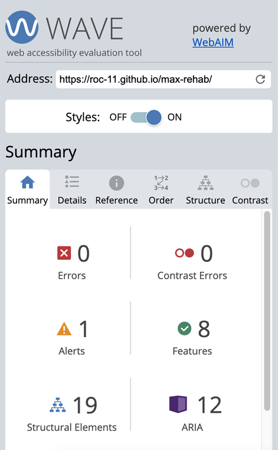

# Max Rehab Physiotherapy - Testing 

[Main README.md file](/README.md)

[View live project](https://roc-11.github.io/max-rehab/)

[View GitHub repository](https://github.com/roc-11/max-rehab)

***
## Table of contents
- [Max Rehab Physiotherapy - Testing](#max-rehab-physiotherapy---testing)
  - [Table of contents](#table-of-contents)
  - [Browser Compatibility](#browser-compatibility)
  - [User Testing](#user-testing)
  - [Manual Testing](#manual-testing)
  - [Validator Testing](#validator-testing)
    - [HTML Validation](#html-validation)
    - [CSS Validation](#css-validation)
  - [Performance](#performance)
  - [Accessibility](#accessibility)

***

## Browser Compatibility

The website has been tested on a range of browers: Google Chrome, Safari & Microsoft Edge. The results were satisfactory.

## User Testing

The entired project was manually tested by the developer to ensure all it appears correctly on a range of devices/screen size, and to ensure that all links work as expected.

The project was also user tested by a some class colleagues on the [Slack](https://slack.com/intl/en-ie/) Code Institute community, and some of my family members. Their helpful advice and suggestions led to a few small UX changes in order to create a better experience.

## Manual Testing

## Validator Testing

### HTML Validation

All pages of the website were tested using the [W3C official HTML validation tool](https://validator.w3.org/). No errors were shown when the site was passed through this tool.

A previous pass through this tool showed multiple errors related to 'trailing slash on void elements'. An autoformat option has to be changed on the CodeAnywhere IDE in order to rectify these.

### CSS Validation

The Cascading Stylesheet code was tested using the [W3C CSS Validator](https://jigsaw.w3.org/css-validator/). No errors were found when the CSS was passed through this tool.

## Performance

[Lighthouse](https://www.webpagetest.org/lighthouse) Google Webdev tools were used to test the performance of the website.

## Accessibility

[Wave](https://wave.webaim.org/) Web Accessibility Evaluation tool was used to check accessibility. It detected a minor alert where table is used for the opening times in the footer. The contrast check passed, as did all other accessibility checks.

Semantic markup was used when developing the site to ensure the site is readable for the visually impaired/those using screen readers and other forms of assistive technology. Alt text descriptions are included for all images and aria-labels for all links.

